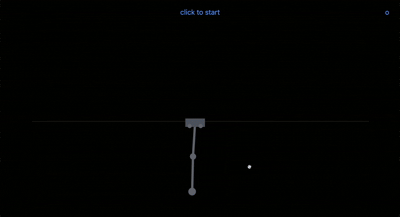

# cart-pole-autoresearch

GitHub: [`bicrick/cart-pole-autoresearch`](https://github.com/bicrick/cart-pole-autoresearch)  
*(old name `double-cart-pole` redirects here.)*

Autonomous research + training loop for **cart–multi-link inverted pendulums**: browser demos, shared physics, GPU PPO/TQC training on GCP, and a standing overnight bot that diagnoses failure modes and iterates without waiting for a human to poke the demo.

<p align="center">
  
</p>

## What this is

| Plant | Equilibria | Status |
| --- | --- | --- |
| **Double** (2 links) | 4: UU / UD / DU / DD | Strong no-walls keeper (`policies/checkpoint-nowalls-best.pt`, min_at_goal ~0.65). Transition-only (`xonly`) explored. |
| **Triple** (3 links) | 8: DDD … UUU → **56** directed transitions | Active focus. Walls-first then void FT (same path that worked on double). Lim-style TQC specialists + swing→hold handoff in flight. |

Goal: interactive demos where you drag the cart/links mid-episode, switch discrete goals on the fly, and the policy recovers — eventually all 56 triple transitions without precomputed trajectories.

## Autoresearch loop (the point)

A Grok Bot agent (`cart-pole`) owns:

1. **Infra** — keep the L4 VM + public TensorBoard alive  
2. **Measure** — near-target / hang hold meters, entropy, OOB, catch basins  
3. **Self-debug** — catch reward hacks (center farming, reward↑/hold=0, dead basins, wrong plant phase) *before* a human notices in the demo  
4. **Iterate** — paper-backed recipe changes, push `main`, sync VM, stage next stretch  

Game plan lives in [`docs/triple-macro-loop.md`](docs/triple-macro-loop.md). Paper notes: [`docs/triple-pendulum-research.md`](docs/triple-pendulum-research.md), [`docs/paper-training-lessons.md`](docs/paper-training-lessons.md). PDFs: [`papers/`](papers/) + [`papers/CITATIONS.txt`](papers/CITATIONS.txt).

**Curriculum lesson (both plants):** train **with inelastic sidewalls first**, get upright/hold good, **then** remove walls for a void / respawn fine-tune. Jumping straight to no-walls invites center + not-dying farming.

## Layout

```
shared/constants.json          # double plant constants (shared train ↔ web)
shared/constants-triple.json   # triple plant (+ trackWalls)
train/physics.py               # double batched torch step
train/physics_triple.py        # triple batched torch step
train/goals.py / goals_triple.py
train/train.py                 # double goal-conditioned PPO
train/train_triple.py          # triple PPO (product reward, flip-augment, …)
train/train_triple_tqc.py      # Lim-style TQC UUU specialist (sb3-contrib)
train/handoff.py / lqr_uuu.py  # swing→hold handoff scaffolding
web/                           # Vite + Canvas demos
policies/                      # checkpoints + exported policy.json for the page
scripts/next-train*.sh         # recipes + continue-* watchers
docs/                          # macro loop, research, lessons
papers/                        # PDFs the loop should cite
```

## Double demo (browser)

```bash
cd web && npm install && npm run dev
```

Loads `web/public/policy.json` as a plain JS MLP (no TF.js / no server). Pick UU/UD/DU/DD, drag cart or links, `P` mutes policy. No episode reset — void off-track respawns when walls are off.

Pygame (same Python physics):

```bash
python3 -m pip install -r requirements.txt
python3 train/play.py
```

## Train (local smoke)

```bash
python3 -m pip install -r requirements.txt
python3 train/train.py --smoke                 # double
python3 train/train_triple.py --smoke          # triple PPO
SMOKE=1 bash scripts/next-train-triple-tqc-uuu.sh   # triple TQC (needs sb3-contrib)
SMOKE=1 bash scripts/next-train-triple-m2-hold.sh   # fawraw M2 UUU hold (quiet-basin)
```

**M2 UUU hold (copy-what-works):** see [`docs/working-impls-reverse-eng.md`](docs/working-impls-reverse-eng.md). Launch: `scripts/next-train-triple-m2-hold.sh` (walls ON, `init_noise=0.05`, TQC `[128,128]`, 150k). Do not start GCP VM until green-lit.

GPU recipes: `scripts/next-train.sh`, `next-train-transitions.sh`, `next-train-triple*.sh`. Watch: [TensorBoard](http://34.148.138.48:6006/) on the training VM (static IP) or `tensorboard --logdir runs`.

## GCP

Project `cartpole-demo`, bot SA `cartpole-bot@cartpole-demo.iam.gserviceaccount.com`, bucket `gs://cartpole-demo-413636930404`. Helpers under `train/gcp/`. Key path (local only): `~/.config/gcloud/cartpole-bot-cartpole-demo.json` — see `train/gcp/bot.env.example`.

One on-demand L4 (`cartpole-train-od`, `us-east1-b`) is the usual trainer. Do not stack GPU VMs; do not train on unrelated projects.

## Physics notes

- `θ = 0` is **upright** (Xin / IFAC convention).  
- State double: `[x, ẋ, θ1, θ̇1, θ2, θ̇2]`. Triple adds link 3.  
- **Walls:** when enabled, cart-only inelastic endstops (clamp `x`, `ẋ=0`) — poles are not propped by wall impulse.  
- **No walls:** cart may leave `|x| > trackLimit` → episode end / demo void respawn; hard `oob_penalty` after reward clip.

## License / papers

Code for this project. PDFs in `papers/` remain under their publishers’ terms.
